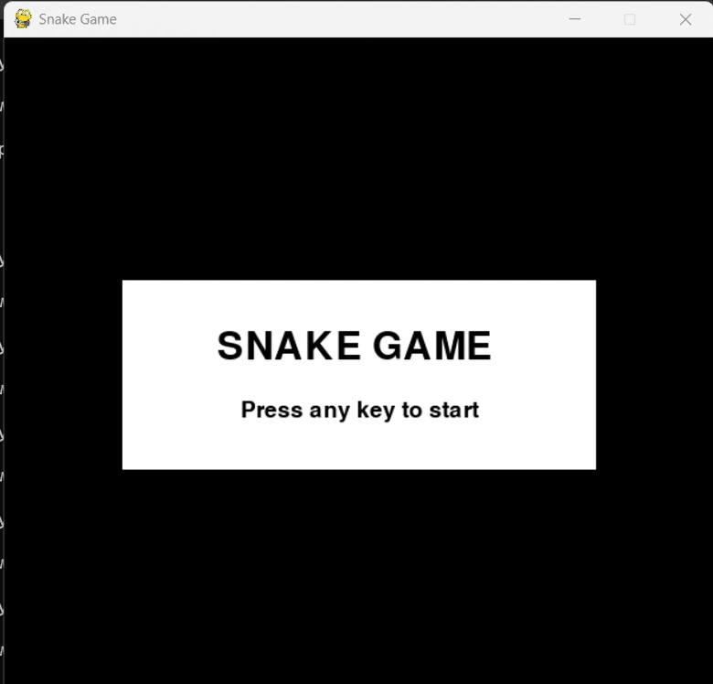
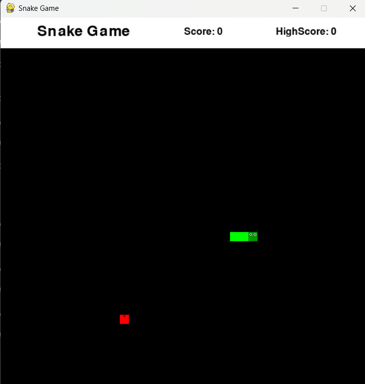
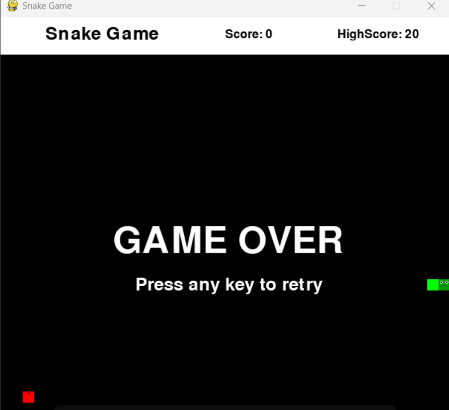

# Snake Game

A classic Snake game built with Python and Pygame featuring modern enhancements and polished visuals.

## Features

- **Animated Snake**: Dark green head with eyes and bright green body
- **Smart Food System**: Red apples with stems that never spawn on the snake
- **Progressive Difficulty**: Speed increases as your score grows
- **Score Tracking**: Current score and high score display
- **Game Over & Restart**: Press any key to restart after game over
- **Custom Logo Support**: Logo display in the header

## Controls

- **Arrow Keys**: Control snake direction (Up, Down, Left, Right)
- **Any Key**: Restart game after game over
- **X Button**: Close game

## Requirements

- Python 3.x
- Pygame

## Installation

1. Clone this repository:
```bash
git clone <repository-url>
cd snakeGame
```

2. Install dependencies:
```bash
pip install -r requirements.txt
```

3. Add your logo (optional):
   - Place a `logo.png` file (40x30 pixels recommended) in the game directory

## How to Run

```bash
python snakeGame.py
```

## Game Rules

- Use arrow keys to control the snake
- Eat red apples to grow and increase your score (+10 points each)
- Avoid hitting walls or your own body
- Game speed increases every 50 points
- Try to beat your high score!

## File Structure

```
snakeGame/
├── snakeGame.py      # Main game file
├── requirements.txt  # Python dependencies
├── logo.png          # Logo image (optional)
├── README.md         # This file
└── screenshots/      # Game screenshots
    ├── start_screen.png
    ├── gameplay.png
    └── game_over.png
```

## Screenshots

### Start Screen


### Gameplay


### Game Over



## License

This project is open source and available under the MIT License.